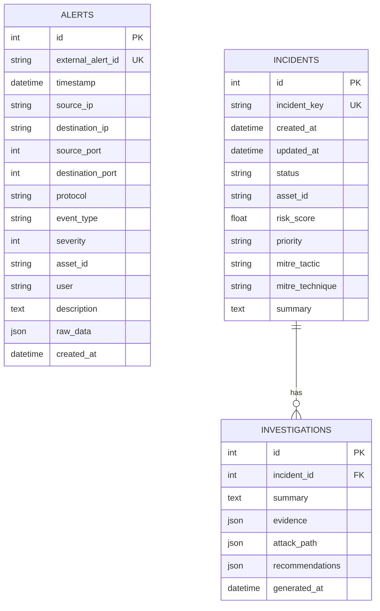

# Sworders SOC — System Architecture Specification

**Project:** Sworders SOC — "3,000 Alerts, One Analyst"  
**Hackathon:** Microsoft Innovate 2026 Round 2  
**Current Status:** Phase 1 (Backend Foundation) Complete  

---

## 1. Executive Summary & Problem Statement

Modern Security Operations Centers (SOCs) suffer from severe alert fatigue. A single analyst is routinely bombarded with **3,000+ un-correlated security alerts daily** across firewalls, EDR agents, identity providers, and cloud workloads. 

**Sworders SOC** solves this problem by transforming high-volume raw alert noise into a handful of prioritized, explainable, evidence-grounded security incidents mapped to MITRE ATT&CK and summarized via Azure OpenAI.

```
+-----------------------------------------------------------------------------------+
|                                 SWORDERS SOC PIPELINE                             |
+-----------------------------------------------------------------------------------+
|                                                                                   |
|  [Security Telemetry] (SIEM, EDR, Firewall, CloudTrail, Auth Logs)                |
|           |                                                                       |
|           v                                                                       |
|  [Phase 1] Alert Ingestion & REST API (FastAPI)               <-- [IMPLEMENTED]   |
|           |                                                                       |
|           v                                                                       |
|  [Phase 1] Alert Normalization & Data Schema (SQLAlchemy/PG)  <-- [IMPLEMENTED]   |
|           |                                                                       |
|           v                                                                       |
|  [Phase 2] Alert Correlation Engine (Temporal & Graph)        <-- [FUTURE: Dev A] |
|           |                                                                       |
|           v                                                                       |
|  [Phase 2] Incident Formation & Aggregation                   <-- [FUTURE: Dev A] |
|           |                                                                       |
|           v                                                                       |
|  [Phase 3] Explainable Risk Scoring Engine                    <-- [FUTURE: Dev B] |
|           |                                                                       |
|           v                                                                       |
|  [Phase 3] MITRE ATT&CK Mapping Engine                        <-- [FUTURE: Dev B] |
|           |                                                                       |
|           v                                                                       |
|  [Phase 4] Azure OpenAI Investigation Summary                 <-- [FUTURE: Dev C] |
|           |                                                                       |
|           v                                                                       |
|  [Phase 5] React Analyst SOC Dashboard                        <-- [FUTURE: Dev D] |
|                                                                                   |
+-----------------------------------------------------------------------------------+
```

---

## 2. End-to-End Pipeline Architecture

### Phase 1: Alert Ingestion & Normalization [IMPLEMENTED]
- **Entrypoint:** `POST /api/alerts` accepts raw and normalized telemetry payloads.
- **Validation:** Pydantic models validate timestamps, IP addresses, port ranges, and severity (1–10).
- **Storage:** Persisted into PostgreSQL `alerts` table with full `raw_data` JSON payload preserved for forensic grounding.
- **Querying:** `GET /api/alerts` enables paginated filtering by severity, event type, and target asset.

### Phase 2: Correlation Engine & Incident Formation [FUTURE — Developer A]
- **Location:** `backend/app/services/correlation_service.py`
- **Mechanism:** Evaluates incoming alerts over configurable sliding time windows (e.g. 15 minutes).
- **Clustering Heuristics:**
  - Same `asset_id` + multi-stage event types (e.g., Port Scan $\to$ Brute Force $\to$ Privilege Escalation).
  - Same `source_ip` or `user` pivot across multiple destinations.
- **Output:** Creates or updates records in the `incidents` table with unique `incident_key`.

### Phase 3: Explainable Risk Scoring & MITRE ATT&CK [FUTURE — Developer B]
- **Location:** `backend/app/services/risk_service.py` & `backend/app/services/mitre_service.py`
- **Risk Calculation:** 
  $$\text{Risk Score} = w_1 \cdot \text{Asset Criticality} + w_2 \cdot \max(\text{Alert Severities}) + w_3 \cdot \text{MITRE Tactic Weight} + w_4 \cdot \text{Frequency Factor}$$
- **MITRE ATT&CK Mapping:** Classifies incidents under MITRE tactics (e.g., *Initial Access*, *Execution*, *Exfiltration*) and specific technique IDs (e.g., *T1078 Valid Accounts*).

### Phase 4: Azure OpenAI Investigation Summary [FUTURE — Developer C]
- **Location:** `backend/app/services/ai_service.py`
- **Mechanism:** Employs Azure OpenAI GPT-4o with strict evidence-grounding system prompts:
  - Extracts key evidence points from linked alert telemetry.
  - Reconstructs chronological attack timelines.
  - Generates prescriptive remediation actions (e.g., isolate host, block IP, revoke credentials).
- **Storage:** Output written to `investigations` table linked to parent `incident_id`.

### Phase 5: SOC Analyst Dashboard [FUTURE — Developer D]
- **Tech:** React + TypeScript + TailwindCSS / Lucide Icons.
- **Consumes:**
  - `GET /api/health` — System status.
  - `GET /api/alerts` — Real-time telemetry feed.
  - `GET /api/incidents` — Prioritized incident queue.
  - `GET /api/incidents/{id}` — Deep-dive investigation view with AI summary and attack graph.

---

## 3. Database Schema Design (PostgreSQL)



---

## 4. Module Boundaries & Developer Integration Guide

To ensure high development velocity in Round 2, strict modular boundaries are enforced:

| Developer | Scope | Key Files | API Changes Required? |
| :--- | :--- | :--- | :--- |
| **Architect (Current)** | Phase 1 Foundation | `main.py`, `core/`, `models/`, `schemas/`, `routes/` | Base Contract Frozen |
| **Developer A** | Alert Correlation | `services/correlation_service.py` | None (writes to `incidents`) |
| **Developer B** | Risk & MITRE Mapping | `services/risk_service.py`, `services/mitre_service.py` | None (populates incident fields) |
| **Developer C** | Azure OpenAI Service | `services/ai_service.py` | None (writes to `investigations`) |
| **Developer D** | React SOC Frontend | `frontend/` | None (pure API client) |

---

## 5. Security & Reliability Principles

1. **Zero Secret Leakage:** `.env` files are ignored by git; API error handlers strip tracebacks and database credentials.
2. **Graceful Degradation:** If the database is temporarily unreachable, `/api/health` returns status `degraded` rather than crashing the worker.
3. **Auditability:** Original raw JSON payloads are retained in `raw_data` to ensure AI summaries remain verifiable against ground-truth logs.
